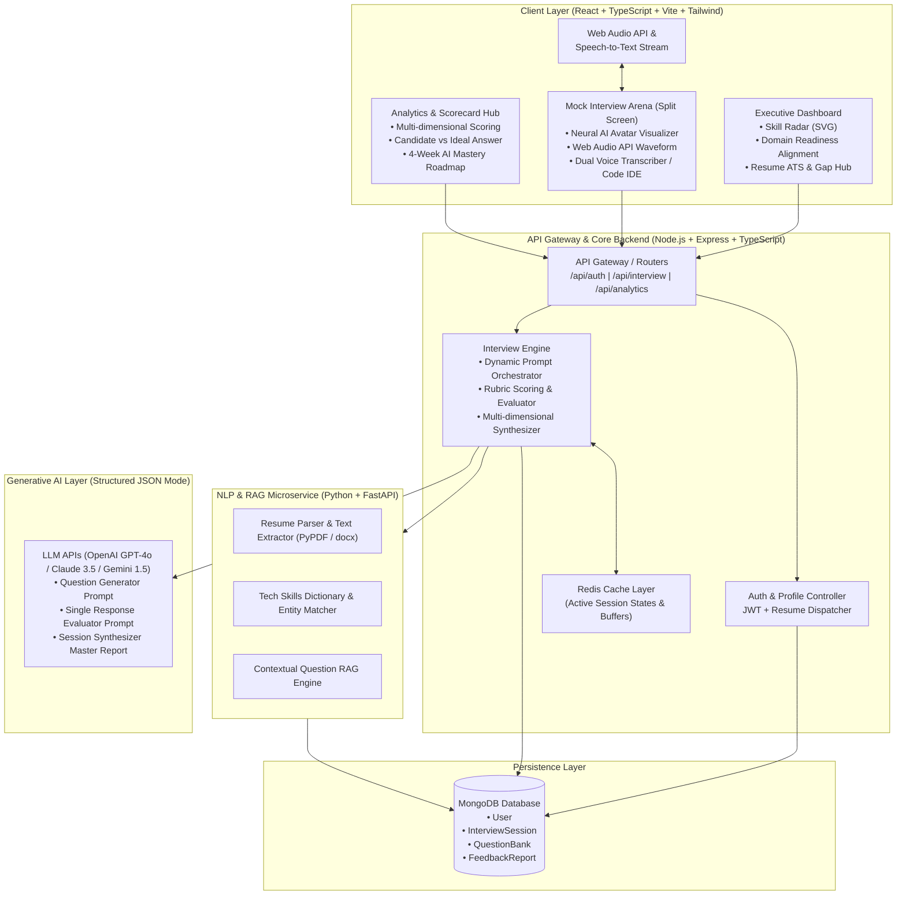

# ELEVATE.AI — Enterprise AI Interview Preparation Platform

A full-stack, enterprise-grade AI mock interview preparation platform designed for software engineers and architects targeting Senior, Lead, and Staff roles. Features real-time Web Audio API visualizers, speech-to-text live stream analysis, interactive coding IDE with automated test suite runners, structured LLM multi-dimensional rubric evaluation, resume ATS parsing & gap analysis, and 360-degree analytics scorecards.

---

## 🏛️ System Architecture Blueprint



---

## 🚀 Key Features

1. **Executive Dark Mode & Aesthetic UI**:
   - Deep slate navy/charcoal backgrounds (`#0B0F19` / `#0F172A`), electric indigo (`#6366F1`) & emerald accents (`#10B981`), frosted glass surfaces.
2. **Interactive Mock Interview Arena (Split-Screen)**:
   - **Left Screen**: Stateful Neural AI Avatar (Idle, Listening, Thinking, Speaking), Web Audio API dynamic frequency waveform canvas, Question card with countdown timer and progressive architectural hints.
   - **Right Screen**: Dual mode switcher:
     - **Voice Mode**: Pulsing waveform mic button (scales with pitch/volume), live speech-to-text transcript buffer, WPM meter, filler word counter, STAR framework helper pills.
     - **Code IDE Mode**: Syntax highlighting, multi-language selector (TypeScript, JavaScript, Python, Java, C++), test suite runner simulation with console execution terminal.
   - **Real-Time Coaching Co-Pilot**: Neon lightning badge with live tooltips and pacing alerts.
3. **Multi-Dimensional AI Rubric Engine**:
   - Structured JSON mode prompts evaluating Technical Accuracy, Communication Clarity, Problem Solving Rigor, Confidence & Delivery, and Code Quality.
4. **360-Degree Analytics & Scorecards**:
   - Circular master score gauge, hiring verdict badge (`Exceptional`, `Strong Hire`, `Hire`, `Borderline`), SVG Skill Radar vs industry benchmarks, side-by-side Candidate vs Staff Model Solution breakdown, and personalized 4-week study roadmap.
5. **Resume Intelligence & ATS Gap Hub**:
   - PDF/Text parser extracting 40+ engineering competencies, calculating ATS compatibility, and generating tailored domain questions.

---

## 📁 Repository Structure

```
c:/ai-interview-platform/
├── backend/                  # Node.js + Express + TypeScript Backend
│   ├── src/
│   │   ├── config/           # Database & Redis configuration with resilient fallbacks
│   │   ├── controllers/      # Auth, Interview, and Analytics controllers
│   │   ├── models/           # Mongoose schemas (User, InterviewSession, QuestionBank, FeedbackReport)
│   │   ├── routes/           # Express API route endpoints
│   │   ├── services/         # LLM service & structured JSON prompt templates
│   │   └── index.ts          # Server entry point
│   ├── package.json
│   └── tsconfig.json
├── python-nlp-service/       # Python FastAPI Microservice
│   ├── app/
│   │   ├── main.py           # FastAPI application
│   │   ├── resume_parser.py  # Resume NLP entity & skills extraction
│   │   ├── rag_engine.py     # Contextual question RAG engine
│   │   └── schemas.py        # Pydantic data models
│   └── requirements.txt
├── frontend/                 # React + TypeScript + Vite + Tailwind
│   ├── src/
│   │   ├── components/
│   │   │   ├── arena/        # AIAvatarVisualizer, AudioWaveform, CodeEditorPanel, VoiceTranscriber
│   │   │   ├── dashboard/    # SkillRadarChart, DomainMatchCard, MetricsGrid, ResumeUploadModal
│   │   │   ├── layout/       # Navbar, Sidebar
│   │   │   └── report/       # ScorecardGrid, AnswerComparison, ActionPlan
│   │   ├── pages/            # DashboardPage, InterviewArenaPage, AnalyticsPage, ResumeHubPage, SystemDesignStudioPage
│   │   ├── services/         # API client, Web Audio API visualizer, Speech Recognition
│   │   ├── types/            # TypeScript interfaces
│   │   ├── App.tsx
│   │   ├── main.tsx
│   │   └── index.css
│   ├── package.json
│   ├── vite.config.ts
│   └── tailwind.config.js
└── README.md
```

---

## ⚡ Quick Start Instructions

### 1. Run the Frontend (React + Vite)
```bash
cd frontend
npm install
npm run dev
```
Open [http://localhost:5173](http://localhost:5173) in your browser.

### 2. Run the Core Backend (Node.js + Express)
```bash
cd backend
npm install
npm run dev
```
API runs at [http://localhost:5000/api](http://localhost:5000/api).

### 3. Run the Python NLP Microservice (FastAPI)
```bash
cd python-nlp-service
pip install -r requirements.txt
python -m uvicorn app.main:app --port 8000 --reload
```
API runs at [http://localhost:8000](http://localhost:8000).
